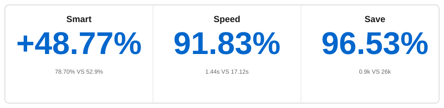

<p align="center">
    <a href="https://github.com/oceanbase/oceanbase">
        
    </a>
</p>

<p align="center">
  <a href="https://powermem.ai">Learn more</a>
  ·
  <a href="https://discord.com/invite/74cF8vbNEs">Join Discord</a>
  ·
  <a href="https://powermem.ai/benchmark">Benchmark Result</a>
</p>

<p align="center">
    <a href="https://pepy.tech/project/powermem">
        
    </a>
    <a href="https://github.com/oceanbase/powermem">
        
    </a>
    <a href="https://pypi.org/project/powermem" target="blank">
        
    </a>
    <a href="https://github.com/oceanbase/powermem/blob/master/LICENSE">
        
    </a>
    <a href="https://img.shields.io/badge/python%20-3.10.0%2B-blue.svg">
        
    </a>
    <a href="https://deepwiki.com/oceanbase/powermem">
        
    </a>
</p>

[English](README.md) | [中文](README_CN.md) | [日本語](README_JP.md)

## Highlights

<div align="center">



</div>

- **More Accurate**: **[48.77% Accuracy Improvement]** More accurate than full-context in the LOCOMO benchmark (78.70% VS 52.9%)
- **Faster**: **[91.83% Faster Response]** Significantly reduced p95 latency for retrieval compared to full-context (1.44s VS 17.12s)
- **More Economical**: **[96.53% Token Reduction]** Significantly reduced costs compared to full-context without sacrificing performance (0.9k VS 26k)

- [See Benchmark Details](https://powermem.ai/benchmark)

# PowerMem - Intelligent Memory System

In AI application development, enabling large language models to persistently "remember" historical conversations, user preferences, and contextual information is a core challenge. PowerMem combines a hybrid storage architecture of vector retrieval, full-text search, and graph databases, and introduces the Ebbinghaus forgetting curve theory from cognitive science to build a powerful memory infrastructure for AI applications. The system also provides comprehensive multi-agent support capabilities, including agent memory isolation, cross-agent collaboration and sharing, fine-grained permission control, and privacy protection mechanisms, enabling multiple AI agents to achieve efficient collaboration while maintaining independent memory spaces.

## Core Features (with demo links below)

### Intelligent Memory Management
- **[Intelligent Memory Extraction](docs/examples/scenario_2_intelligent_memory.md)**: Extract memories through LLM models
- **Ebbinghaus Forgetting Curve**: Smart memory optimization based on cognitive science
- **Memory Decay & Reinforcement**: Dynamic memory retention based on usage patterns

### Multi-Agent Support
- **[Agent Isolation](docs/examples/scenario_3_multi_agent.md)**: Separate memory spaces for different agents

### Multimodal Support
- **Text and Image Memory**: Support text and image memory storage and retrieval for richer context understanding

### Deeply Optimized Data Storage
- **Sub Stores Support**: Partition data management through sub stores to handle ultra-large-scale data
- **Hybrid Retrieval**: Hybrid retrieval capabilities supporting vector search, full-text search, and graph retrieval
- **Graph Retrieval**: Support LLM extraction of entities and relationships to build knowledge graphs, enabling multi-hop graph traversal for retrieving complex memory relationships
- **Hybrid Storage**: Combine vector search with graph relationships for enhanced retrieval

### Developer Friendly
- **Lightweight Integration**: Support Python SDK/MCP integration, compatible with mem0 usage

## Quick Start

### Installation

```bash
pip install powermem
```

### Basic Usage

**✨ Simplest Way**: Create memory from `.env` file automatically! [Configuration Reference](configs/env.example)

```python
from powermem import create_memory

# Automatically loads from .env
memory = create_memory()

# Add memory
memory.add("User likes coffee", user_id="user123")

# Search memories
memories = memory.search("user preferences", user_id="user123")
for memory in memories:
    print(f"- {memory.get('memory')}")
```

For more detailed examples and usage patterns, see the [Getting Started Guide](docs/guides/0001-getting_started.md).

## Integrations & Demos

- **LangChain Integration**: Build medical support chatbot using LangChain + PowerMem + OceanBase ([Example](examples/langchain/README.md))
- **Langgraph Integration**: Build customer chatbot using LangGraph + PowerMem ([Example](examples))

## Documentation

- **[Getting Started](docs/guides/0001-getting_started.md)**: Installation and quick start guide
- **[Configuration Guide](docs/guides/0002-configuration.md)**: Complete configuration options
- **[Multi-Agent Guide](docs/guides/0004-multi_agent.md)**: Multi-agent scenarios and examples
- **[Integrations Guide](docs/guides/0005-integrations.md)**: LLM and embedding provider integrations
- **[Sub Stores Guide](docs/guides/0006-sub_stores.md)**: Sub stores usage and examples
- **[API Documentation](docs/api/overview.md)**: Complete API reference
- **[Architecture Guide](docs/architecture/overview.md)**: System architecture and design
- **[Examples](docs/examples/overview.md)**: Interactive Jupyter notebooks and use cases

## Development

### Setup Development Environment

```bash
# Clone repository
git clone https://github.com/powermem/powermem.git
cd powermem

# Install development dependencies
pip install -e ".[dev,test]"
```

## Contributing

We welcome contributions! Please see our contributing guidelines and code of conduct.

## Support

- **Issues**: [GitHub Issues](https://github.com/oceanbase/powermem/issues)
- **Discussions**: [GitHub Discussions](https://github.com/oceanbase/powermem/discussions)

---

## License

This project is licensed under the Apache License 2.0 - see the [LICENSE](LICENSE) file for details.