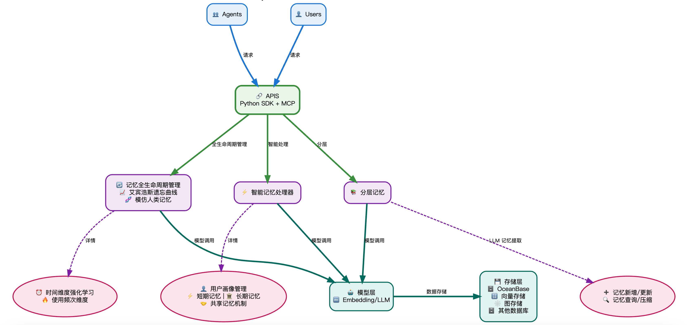

[English](README.md) | [中文](README_CN.md) | [日本語](README_JP.md)

<p align="center">
  <a href="https://powermem.ai">Learn more</a>
  ·
  <a href="https://discord.com/invite/74cF8vbNEs">Join Discord</a>
  ·
  <a href="https://powermem.ai/benchmark">Benchmark Result</a>
</p>

<p align="center">
    <a href="https://pepy.tech/project/powermem">
        
    </a>
    <a href="https://github.com/oceanbase/powermem">
        
    </a>
    <a href="https://pypi.org/project/powermem" target="blank">
        
    </a>
    <a href="https://github.com/oceanbase/powermem/blob/master/LICENSE">
        
    </a>
    <a href="https://img.shields.io/badge/python%20-3.10.0%2B-blue.svg">
        
    </a>
    <a href="https://deepwiki.com/oceanbase/powermem">
        
    </a>
</p>

<p align="center">
  <strong>⚡ +48.53% Accuracy vs. OpenAI Memory • 🚀 91.76% Faster • 💰 96.53% Fewer Tokens</strong>
</p>

## 亮点

**更准**:**[准确率提升 48.53%]%**在LOCOMO基准测试中，相比OpenAI记忆功能表现更优
**更快**：**[响应速度快 91.76%]**相较于全上下文方法，确保大规模应用下的低延迟体验
**更省**：**[Token用量降低 96.53%]**相比全上下文方法，在不牺牲性能的前提下显著降低成本

- [Benchmark 详情参见](https://powermem.ai/benchmark)

# PowerMem - 智能AI记忆系统

在 AI 应用开发中，如何让大语言模型持久化地"记住"历史对话、用户偏好和上下文信息是一个核心挑战。PowerMem 融合向量检索、全文检索和图数据库的混合存储架构，并引入认知科学的艾宾浩斯遗忘曲线理论，为 AI 应用构建了强大的记忆基础设施。系统还提供完善的多智能体支持能力，包括智能体记忆隔离、跨智能体协作共享、细粒度权限控制和隐私保护机制，让多个 AI 智能体能够在保持独立记忆空间的同时实现高效协作。

## 核心特性

### 智能记忆管理
- **记忆的智能提取**：通过 LLM 模型进行记忆的提取
- **艾宾浩斯遗忘曲线**：基于认知科学的智能记忆优化
- **自动重要性评分**：AI 驱动的记忆重要性评估
- **记忆衰减与强化**：基于使用模式的动态记忆保留
- **智能检索**：上下文感知的记忆搜索和排序

### 多智能体支持
- **智能体隔离**：为不同智能体提供独立的记忆空间
- **跨智能体协作**：共享记忆访问和协作跟踪
- **权限控制**：细粒度的智能体记忆访问控制
- **隐私保护**：内置隐私控制和数据保护

### 深度优化数据存储
- **支持多种数据库存储**：可扩展的存储架构，支持OceanBase、SeekDB、PostgreSQL、SQLite 等数据库
- **支持子存储（Sub Stores）**：通过子存储实现数据的分区管理，应对超大规模数据
- **混合检索**：支持向量检索、全文搜索以及图检索的混合检索能力
- **知识图谱**：支持LLM 和 NLP 两种模式提取实体和关系以构建知识图谱
- **图检索**：多跳图遍历，用于复杂的记忆关系
- **关系搜索**：通过图查询发现记忆之间的连接
- **混合存储**：结合向量搜索和图关系以增强检索

### 开发者友好
- **轻量级接入方式**：支持Python SDK/MCP 的接入方式，兼容mem0的使用；

## 快速开始

### 安装

```bash
# 生产环境，包含 LLM 和向量存储依赖
pip install powermem[llm,vector_stores]

# 开发环境，包含所有依赖
pip install powermem[dev,test,llm,vector_stores,extras]
```

### 基本使用

**✨ 最简单的方式**：从 `.env` 文件读取配置自动创建记忆！[配置文件参考](configs/env.example)

```python
from powermem import create_memory

# 自动从 .env 加载配置
memory = create_memory()

# 添加记忆
memory.add("用户喜欢咖啡", user_id="user123")

# 搜索记忆
memories = memory.search("用户偏好", user_id="user123")
for memory in memories:
    print(f"- {memory.get('memory')}")
```

更多详细示例和使用模式，请参阅[入门指南](docs/guides/0001-getting_started.md)。

## 集成与演示

- **Langgraph 集成**: 使用 LangGraph + PowerMem 构建客户机器人 ([Example](examples))
- **LangChain 集成**: 使用 LangChain + PowerMem 构建多智能体 ([Example](examples))

## 架构



PowerMem 采用模块化架构，支持：

- **核心记忆引擎**：基础记忆操作和智能管理
- **智能体框架**：多智能体支持，包含协作和权限管理
- **存储适配器**：可插拔的存储后端（向量、图数据库和混合存储）
- **图存储**：基于关系的图存储，用于复杂的实体记忆互连
- **LLM 集成**：多 LLM 提供商支持
- **嵌入服务**：多种嵌入模型集成

有关详细的架构信息，请参阅[架构指南](docs/architecture/overview.md)。

## 文档

- **[入门指南](docs/guides/0001-getting_started.md)**：安装和快速开始指南
- **[配置指南](docs/guides/0002-configuration.md)**：完整的配置选项
- **[多智能体指南](docs/guides/0004-multi_agent.md)**：多智能体场景和示例
- **[集成指南](docs/guides/0005-integrations.md)**：LLM 和嵌入提供商集成
- **[子存储指南](docs/guides/0006-sub_stores.md)**：子存储的使用方法和示例
- **[API 文档](docs/api/overview.md)**：完整的 API 参考
- **[架构指南](docs/architecture/overview.md)**：系统架构和设计
- **[示例](docs/examples/overview.md)**：交互式 Jupyter 笔记本和使用案例

## 开发

### 设置开发环境

```bash
# 克隆仓库
git clone https://github.com/powermem/powermem.git
cd powermem

# 安装开发依赖
pip install -e ".[dev,test,llm,vector_stores]"
```

## 贡献

我们欢迎贡献！请参阅我们的贡献指南和行为准则。

## 支持

- **问题反馈**：[GitHub Issues](https://github.com/oceanbase/powermem/issues)
- **讨论交流**：[GitHub Discussions](https://github.com/oceanbase/powermem/discussions)

---

## 许可证

本项目采用 Apache License 2.0 许可证 - 详情请参阅 [LICENSE](LICENSE) 文件。