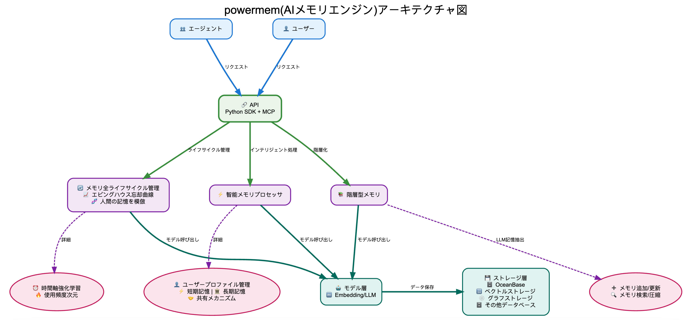

[English](README.md) | [中文](README_CN.md) | [日本語](README_JP.md)

<p align="center">
  <a href="https://powermem.ai">Learn more</a>
  ·
  <a href="https://discord.com/invite/74cF8vbNEs">Join Discord</a>
  ·
  <a href="https://powermem.ai/benchmark">Benchmark Result</a>
</p>

<p align="center">
    <a href="https://pepy.tech/project/powermem">
        
    </a>
    <a href="https://github.com/oceanbase/powermem">
        
    </a>
    <a href="https://pypi.org/project/powermem" target="blank">
        
    </a>
    <a href="https://github.com/oceanbase/powermem/blob/master/LICENSE">
        
    </a>
    <a href="https://img.shields.io/badge/python%20-3.10.0%2B-blue.svg">
        
    </a>
    <a href="https://deepwiki.com/oceanbase/powermem">
        
    </a>
</p>

<p align="center">
  <strong>⚡ OpenAI Memory より 48.53% 高精度 • 🚀 91.76% 高速 • 💰 96.53% トークン削減</strong>
</p>

## ハイライト

**より正確**：**[精度 48.53% 向上]** LOCOMO ベンチマークで OpenAI Memory を上回る性能
**より高速**：**[91.76% 高速な応答]** 全コンテキスト方式と比較し、大規模アプリケーションでの低遅延を保証
**より経済的**：**[96.53% トークン削減]** 全コンテキスト方式と比較し、性能を犠牲にすることなくコストを大幅に削減

- [ベンチマーク詳細を参照](https://powermem.ai/benchmark)

# PowerMem - インテリジェントメモリシステム

AI アプリケーション開発において、大規模言語モデルが履歴会話、ユーザー設定、コンテキスト情報を永続的に「記憶」できるようにすることは、核心的な課題です。PowerMem は、ベクトル検索、全文検索、グラフデータベースのハイブリッドストレージアーキテクチャを組み合わせ、認知科学のエビングハウス忘却曲線理論を導入して、AI アプリケーション向けの強力なメモリインフラストラクチャを構築します。システムは、エージェントメモリの分離、エージェント間のコラボレーションと共有、きめ細かい権限制御、プライバシー保護メカニズムを含む、包括的なマルチエージェントサポート機能も提供し、複数の AI エージェントが独立したメモリ空間を維持しながら効率的なコラボレーションを実現できるようにします。

## アーキテクチャ



PowerMem は、以下をサポートするモジュラーアーキテクチャで構築されています：

- **コアメモリエンジン**：基本メモリ操作とインテリジェント管理
- **エージェントフレームワーク**：コラボレーションと権限を備えたマルチエージェントサポート
- **ストレージアダプター**：プラガブルなストレージバックエンド（ベクトル、グラフ、ハイブリッド）
- **グラフストレージ**：複雑なメモリ相互接続のための関係ベースのグラフストレージ
- **LLM 統合**：複数の LLM プロバイダーサポート
- **埋め込みサービス**：さまざまな埋め込みモデル統合

詳細なアーキテクチャ情報については、[アーキテクチャガイド](docs/architecture/overview.md) を参照してください。

## 主な機能

### インテリジェントメモリ管理
- **メモリのインテリジェント抽出**：LLM モデルによるメモリの抽出
- **エビングハウス忘却曲線**：認知科学に基づくスマートメモリ最適化
- **自動重要度スコアリング**：AI 駆動のメモリ重要度評価
- **メモリ減衰と強化**：使用パターンに基づく動的メモリ保持
- **インテリジェント検索**：コンテキストを意識したメモリ検索とランキング

### マルチエージェントサポート
- **エージェント分離**：異なるエージェント用の独立したメモリ空間
- **エージェント間コラボレーション**：共有メモリアクセスとコラボレーショントラッキング
- **権限制御**：エージェントメモリのきめ細かいアクセス制御
- **プライバシー保護**：組み込みのプライバシー制御とデータ保護

### 深く最適化されたデータストレージ
- **複数のデータベースサポート**：拡張可能なストレージアーキテクチャ、OceanBase、SeekDB、PostgreSQL、SQLite などをサポート
- **サブストア（Sub Stores）サポート**：サブストアによるデータのパーティション管理で、超大规模データに対応
- **ハイブリッド検索**：ベクトル検索、全文検索、グラフ検索のハイブリッド検索機能をサポート
- **ナレッジグラフ**：LLM と NLP の2つのモードでエンティティと関係を抽出し、ナレッジグラフを構築
- **グラフ検索**：複雑なメモリ関係のためのマルチホップグラフトラバーサル
- **関係検索**：グラフクエリを通じてメモリ間の接続を発見
- **ハイブリッドストレージ**：ベクトル検索とグラフ関係を組み合わせて検索を強化

### 開発者フレンドリー
- **軽量な統合方式**：Python SDK/MCP の統合方式をサポートし、mem0 の使用と互換性あり

## クイックスタート

### インストール

```bash
# 本番環境、LLM とベクトルストアの依存関係を含む
pip install powermem[llm,vector_stores]

# 開発環境、すべての依存関係を含む
pip install powermem[dev,test,llm,vector_stores,extras]
```

### 基本的な使用方法

**✨ 最も簡単な方法**：`.env` ファイルから自動的にメモリを作成！[設定ファイル参照](configs/env.example)

```python
from powermem import create_memory

# .env から自動的に読み込む
memory = create_memory()

# メモリを追加
memory.add("ユーザーはコーヒーが好き", user_id="user123")

# メモリを検索
memories = memory.search("ユーザー設定", user_id="user123")
for memory in memories:
    print(f"- {memory.get('memory')}")
```

より詳細な例と使用パターンについては、[はじめにガイド](docs/guides/0001-getting_started.md) を参照してください。

## 統合とデモ

- **Langgraph 統合**: LangGraph + PowerMem を使用してカスタマーロボットを構築 ([Example](examples))
- **LangChain 統合**: LangChain + PowerMem を使用してマルチエージェントを構築 ([Example](examples))

## ドキュメント

- **[はじめに](docs/guides/0001-getting_started.md)**：インストールとクイックスタートガイド
- **[設定ガイド](docs/guides/0002-configuration.md)**：完全な設定オプション
- **[マルチエージェントガイド](docs/guides/0004-multi_agent.md)**：マルチエージェントのシナリオと例
- **[統合ガイド](docs/guides/0005-integrations.md)**：LLM と埋め込みプロバイダーの統合
- **[サブストアガイド](docs/guides/0006-sub_stores.md)**：サブストアの使用方法と例
- **[API ドキュメント](docs/api/overview.md)**：完全な API リファレンス
- **[アーキテクチャガイド](docs/architecture/overview.md)**：システムアーキテクチャと設計
- **[例](docs/examples/overview.md)**：インタラクティブな Jupyter ノートブックとユースケース

## 開発

### 開発環境のセットアップ

```bash
# リポジトリをクローン
git clone https://github.com/powermem/powermem.git
cd powermem

# 開発依存関係をインストール
pip install -e ".[dev,test,llm,vector_stores]"
```

## 貢献

貢献を歓迎します！貢献ガイドラインと行動規範をご覧ください。

## サポート

- **問題報告**：[GitHub Issues](https://github.com/oceanbase/powermem/issues)
- **ディスカッション**：[GitHub Discussions](https://github.com/oceanbase/powermem/discussions)

---

## ライセンス

このプロジェクトは Apache License 2.0 の下でライセンスされています - 詳細については [LICENSE](LICENSE) ファイルを参照してください。

