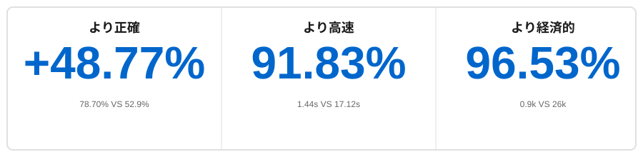

<p align="center">
    <a href="https://github.com/oceanbase/oceanbase">
        
    </a>
</p>

<p align="center">
  <a href="https://powermem.ai">Learn more</a>
  ·
  <a href="https://discord.com/invite/74cF8vbNEs">Join Discord</a>
  ·
  <a href="https://powermem.ai/benchmark">Benchmark Result</a>
</p>

<p align="center">
    <a href="https://pepy.tech/project/powermem">
        
    </a>
    <a href="https://github.com/oceanbase/powermem">
        
    </a>
    <a href="https://pypi.org/project/powermem" target="blank">
        
    </a>
    <a href="https://github.com/oceanbase/powermem/blob/master/LICENSE">
        
    </a>
    <a href="https://img.shields.io/badge/python%20-3.10.0%2B-blue.svg">
        
    </a>
    <a href="https://deepwiki.com/oceanbase/powermem">
        
    </a>
</p>

[English](README.md) | [中文](README_CN.md) | [日本語](README_JP.md)

## ハイライト

<div align="center">



</div>

- **より正確**：**[精度 48.77% 向上]** LOCOMO ベンチマークで full-context より正確（78.70% VS 52.9%）
- **より高速**：**[91.83% 高速な応答]** full-context と比較し、検索の p95 遅延が大幅に減少（1.44s VS 17.12s）
- **より経済的**：**[96.53% トークン削減]** full-context と比較し、性能を犠牲にすることなくコストを大幅に削減（0.9k VS 26k）

- [ベンチマーク詳細を参照](https://powermem.ai/benchmark)

# PowerMem - インテリジェントメモリシステム

AI アプリケーション開発において、大規模言語モデルが履歴会話、ユーザー設定、コンテキスト情報を永続的に「記憶」できるようにすることは、核心的な課題です。PowerMem は、ベクトル検索、全文検索、グラフデータベースのハイブリッドストレージアーキテクチャを組み合わせ、認知科学のエビングハウス忘却曲線理論を導入して、AI アプリケーション向けの強力なメモリインフラストラクチャを構築します。システムは、エージェントメモリの分離、エージェント間のコラボレーションと共有、きめ細かい権限制御、プライバシー保護メカニズムを含む、包括的なマルチエージェントサポート機能も提供し、複数の AI エージェントが独立したメモリ空間を維持しながら効率的なコラボレーションを実現できるようにします。

## 核心機能

### インテリジェントメモリ管理
- **[メモリのインテリジェント抽出](docs/examples/scenario_2_intelligent_memory.md)**：LLM モデルによるメモリの抽出
- **エビングハウス忘却曲線**：認知科学に基づくスマートメモリ最適化
- **メモリ減衰と強化**：使用パターンに基づく動的メモリ保持

### マルチエージェントサポート
- **[エージェント分離](docs/examples/scenario_3_multi_agent.md)**：異なるエージェント用の独立したメモリ空間

### マルチモーダルサポート
- **テキスト、画像、音声メモリ**：テキスト、画像、音声など複数のモーダルのメモリ保存と検索をサポートし、より豊富なコンテキスト理解を実現

### 深く最適化されたデータストレージ
- **[サブストア（Sub Stores）サポート](docs/examples/scenario_6_sub_stores.md)**：サブストアによるデータのパーティション管理で、超大规模データに対応
- **ハイブリッド検索**：ベクトル検索、全文検索、グラフ検索のハイブリッド検索機能をサポート
- **グラフ検索**：LLM によるエンティティと関係の抽出をサポートし、ナレッジグラフを構築。複雑なメモリ関係を検索するためのマルチホップグラフトラバーサル

### 開発者フレンドリー
- **軽量な統合方式**：Python SDK/MCP の統合方式をサポートし、mem0 の使用と互換性あり

## クイックスタート

### インストール

```bash
pip install powermem
```

### 基本的な使用方法

**✨ 最も簡単な方法**：`.env` ファイルから自動的にメモリを作成！[設定ファイル参照](configs/env.example)

```python
from powermem import create_memory

# .env から自動的に読み込む
memory = create_memory()

# メモリを追加
memory.add("ユーザーはコーヒーが好き", user_id="user123")

# メモリを検索
memories = memory.search("ユーザー設定", user_id="user123")
for memory in memories:
    print(f"- {memory.get('memory')}")
```

より詳細な例と使用パターンについては、[はじめにガイド](docs/guides/0001-getting_started.md) を参照してください。

## 統合とデモ

- **LangChain 統合**: LangChain + PowerMem + OceanBase を使用して医療サポートロボットを構築 ([Example](examples/langchain/README.md))
- **Langgraph 統合**: LangGraph + PowerMem + OceanBase を使用してカスタマーロボットを構築 ([Example](examples/langgraph/README.md))

## ドキュメント

- **[はじめに](docs/guides/0001-getting_started.md)**：インストールとクイックスタートガイド
- **[設定ガイド](docs/guides/0002-configuration.md)**：完全な設定オプション
- **[マルチエージェントガイド](docs/guides/0004-multi_agent.md)**：マルチエージェントのシナリオと例
- **[統合ガイド](docs/guides/0005-integrations.md)**：LLM と埋め込みプロバイダーの統合
- **[サブストアガイド](docs/guides/0006-sub_stores.md)**：サブストアの使用方法と例
- **[API ドキュメント](docs/api/overview.md)**：完全な API リファレンス
- **[アーキテクチャガイド](docs/architecture/overview.md)**：システムアーキテクチャと設計
- **[例](docs/examples/overview.md)**：インタラクティブな Jupyter ノートブックとユースケース
- **[開発者ドキュメント](docs/development/overview.md)**：開発者ドキュメント

## サポート

- **問題フィードバック**：[GitHub Issues](https://github.com/oceanbase/powermem/issues)
- **ディスカッション交流**：[GitHub Discussions](https://github.com/oceanbase/powermem/discussions)

---

## ライセンス

このプロジェクトは Apache License 2.0 の下でライセンスされています - 詳細については [LICENSE](LICENSE) ファイルを参照してください。

