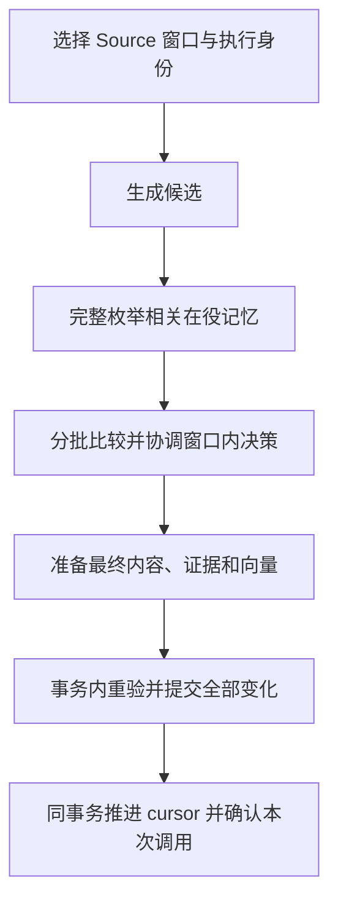

# Atomic Memory 实现设计

- 行为依据：[RFC 1809：Atomic Memory 独立记忆制品](../rfcs/1809-atomic-memory.md)。
- 检索规范：[RFC 1803](https://github.com/oceanbase/powercontext/pull/1803)。
- 迁移规范：[RFC 1771](https://github.com/oceanbase/powercontext/pull/1771)。
- 代码核对基线：`ae952f7042eecc331441d05f5847e44815fa2dd8`。
- 提案依据：RFC 1809 的 `ef7ce289088f3bd1176169d66b12182026a765c2`；RFC 1771 的 `cca48f151799d26c7d6dc2a03317dd094d93d3b3`。
- 本文按提案通过后的行为设计实现。新增的 Family、数据表、接口和处理流程尚未实现。

## 1. 总体结构

一条记忆是一个 `atomic-memory` Artifact。Scope 负责组织和 Source 消费进度，Artifact 负责单条记忆的内容、版本与证据。

| 内容 | 存放位置 | 更新方式 |
| --- | --- | --- |
| 记忆正文、合并输入标记 | 公共 `pc_artifacts.content` | 产生本条记忆的新 revision |
| Source 依据、合并输入及其他 Artifact 的精确引用 | 公共 lineage 表 | 随本条记忆的 revision 保存 |
| 当前内容版本 | 公共 `pc_artifact_heads` | 沿用现有 head 和写锁 |
| 四种状态、当前合并去向 | 新增 `pc_atomic_memory_states` | 与 head 摘要及投影同事务更新 |
| 当前正文、全文与向量检索数据 | 新增 `pc_atomic_memory_current` | 一条在役记忆对应一行，随权威数据同步更新，可重建 |
| Source 消费进度、任务调度 | 现有 cursor 和 supervisor 表 | 每个 Source 窗口提交时推进 |
| 抽取候选、召回结果、中间判断 | 本次 Worker 的内存 | 提交后丢弃；失败时重新计算 |
| 旧集合快照和旧引用 | 保留的旧数据及 API 适配层 | 已有历史只读；升级后的旧接口兼容见第 9.2 节 |

运行期新增两张 Family 数据表：一张状态表、一张当前检索投影表。合并和抽取不各自建立操作流水或工作表。

一个 Source 窗口内，先完成候选生成、相关记忆比较和向量准备，再用一个事务提交全部变化及 cursor。
分批只控制检索和模型输入；数据库不会先提交其中几个候选。

这一选择的代价是：未提交窗口失败后，需要重新调用模型；窗口实际修改较多记忆时，最终事务也会变大。
本设计不提供候选级断点续跑，也不提供手工请求的持久幂等回执。

## 2. 复用的现有能力

| 当前能力 | 实现入口 | 本次调整 |
| --- | --- | --- |
| 不可变内容、head、精确版本读取 | [ArtifactRepository](../../../src/powercontext/builtin/persistence/artifacts.py) | 注册新 Family；提供按固定顺序锁定多个 head 的内部方法 |
| Source 和 Artifact 引用 | [ArtifactLineage](../../../src/powercontext/artifacts/models.py) | 复用 sources/artifacts；合并输入的精确版本保存在 artifacts 中 |
| 三态治理及 generation | [artifact_governance.py](../../../src/powercontext/builtin/persistence/artifact_governance.py) | 公共 head 保留摘要，四态由 Atomic 服务维护 |
| Family 写入 | [family_management.py](../../../src/powercontext/builtin/persistence/family_management.py) | Create/Replace 进入 Atomic writer |
| Source 窗口及原子提交 | [Memory runtime](../../../src/powercontext/builtin/runtime/relational.py)、[Topic publisher](../../../src/powercontext/builtin/runtime/topic_memory_processing.py) | 复用准备、提交和 cursor CAS；去掉唯一 Memory 集合依赖 |
| 调度、租约、调用确认 | [ScopeInvocation](../../../src/powercontext/builtin/runtime/processing_execution.py) | 沿用 guard、fence 和 complete |
| 全文、向量普通搜索 | [memory_index.py](../../../src/powercontext/builtin/persistence/memory_index.py) | 普通搜索可参考；完整阈值枚举另设接口 |
| 标签 | [tags.py](../../../src/powercontext/builtin/persistence/tags.py) | 标签仍以公共表为权威，变更事务内刷新投影 |
| Owner、共享及后台执行身份 | [授权仓库](../../../src/powercontext/server/authz/repository.py)、[WorkerSecurity](../../../src/powercontext/server/processing_security.py) | 建立 Owner、校验权限和发布投影使用同一事务 |

`ArtifactRepository.revise()` 当前只比较内容 revision。若记忆在正文未变的情况下被合并，旧任务仍可能拿着相同 revision。
Atomic writer 因此必须在取得 head 写锁后检查 Family 状态，不能只依靠通用正文 CAS。

supervisor 保存调度和消费进度，不保存候选及模型中间结果。本设计复用它的现有职责，不把候选载荷塞进调度表。

## 3. 制品内容与状态

### 3.1 正文和版本

身份为 `(scope_id, family="atomic-memory", artifact_id)`。普通内容示例：

```json
{
  "schema": "powercontext.atomic-memory.v1",
  "kind": "preference",
  "text": "生产环境默认部署在华北区域。"
}
```

事实的适用条件、时间和原因保留在 text。SourceRef、ArtifactRef 继续使用公共 lineage。
`creation` 和恢复来源等维护信息由服务端构造；模型或客户端不能绕过领域校验自行指定。

revision 对应本条记忆的内容及该次写入的依据。
遗忘、冻结、重新入役和退役只改状态，不增加内容 revision。恢复历史正文则创建新 revision，不把 head 指针拨回旧版本。

新 revision 的证据沿用现有规则：普通 Source 通过生成资格检查后可作为直接证据；原版本、合并输入和恢复来源保留精确 Artifact lineage。
手工写入的 `lineage_only` Source 绑定原来的精确目标，不能直接复制给新 revision。新手工操作生成绑定新目标的内部 Source，原证据通过历史 Artifact 访问。

### 3.2 四态

| Family 状态 | 公共 head 摘要 | 正常搜索 | 内容修改 | 恢复方式 |
| --- | --- | --- | --- | --- |
| `active` | `active` | 参与 | 可以 | 可恢复指定历史内容 |
| `forgotten` | `deprecated` | 不参与 | 可显式编辑，保持遗忘 | 可单独恢复在役 |
| `merged` | `deprecated` | 不参与 | 拒绝 | 撤销相关合并后恢复 |
| `retired` | `retired` | 不参与 | 拒绝 | 不可恢复该身份 |

四态以 Family 状态表为权威。公共 `lifecycle_state` 用于既有通用过滤；通用三态接口不能绕过 Atomic 服务修改状态。
`replacement_artifact_id` 不承担合并关系。

`state_version` 单调递增，与公共 `governance_generation` 在同一事务内同步为相同值。
仅内容变化时，revision 增长，state_version 不变。模型计划与恢复预览同时检查这两个版本。

精确读取四种状态都需鉴权；管理列表允许按状态查看非在役记忆。
退役用于被撤销的合并结果，以及迁移中已经失去直接恢复能力的旧条目。普通遗忘不会直接退役。

状态表保存当前状态，不提供每次遗忘、恢复的完整事件时间线。制品内容历史、合并依据和迁移前已有的生命周期历史仍然保留。

### 3.3 合并输入复用 Artifact lineage

A@3、B@5 合并生成 C，促成本次合并的 Source 和输入记忆都使用已有 lineage。
若生成 C 时还参考了 D@2，C@1 的相关字段如下：

```json
{
  "artifact_id": "C",
  "revision": 1,
  "content": {
    "schema": "powercontext.atomic-memory.v1",
    "kind": "preference",
    "text": "生产环境使用华北区域，灾备使用华东区域。",
    "creation": {
      "type": "merge",
      "input_artifact_ids": ["A", "B"]
    }
  },
  "lineage": {
    "sources": [
      {"source_type": "conversation", "source_id": "S1"}
    ],
    "artifacts": [
      {"family": "atomic-memory", "artifact_id": "A", "revision": 3},
      {"family": "atomic-memory", "artifact_id": "B", "revision": 5},
      {"family": "atomic-memory", "artifact_id": "D", "revision": 2}
    ]
  }
}
```

`lineage.artifacts` 保存完整 ArtifactRef，落到现有 `pc_artifact_lineage_artifacts`；Source 引用落到 `pc_artifact_lineage_sources`。
这些引用沿用仓库调用传入的 Scope。示例中的 Source 仍需满足现有资格校验。

`creation.type=merge` 标明 C 由合并创建，`input_artifact_ids` 从该版本的 lineage 中选出参与合并的 Atomic Memory。
这里只保存角色标记，不再复制输入 revision 或另一份完整引用。上例只冻结 A/B，D 保持原状；撤销合并也不恢复或修改 D。

Family 服务写入时校验：输入至少包含两个不同 ID，均为同一 Scope 的 atomic-memory；每个选中的 ID 在 C@1 的
lineage.artifacts 中恰好对应一个该 Family 的精确版本，并且与事务内锁定的当前在役版本一致。
缺少引用、重复输入或同一输入出现多个版本都拒绝，不能退回读取 latest 来补齐。未选中的 Artifact 引用仍按普通证据处理。

`creation` 只在首个版本保存。C 后续修订保存各自的直接依据，不机械复制初始输入列表；解释或撤销创建 C 的合并时，
始终读取 C@1 的标记及 lineage。恢复历史内容也不把旧 creation 复制到新 revision。

当前状态同时保存 `A.merged_into_id=C`、`B.merged_into_id=C`。两部分职责不同：

- C@1 的 creation 标记和 lineage 共同说明哪些精确版本被合并，这段历史不可变。
- 输入的当前去向说明这次合并是否仍然生效；撤销时清空，后续再次合并时指向新的结果。

只处于 merged 状态的记忆可以有当前去向。结果首个版本的输入标记必须选中这条记忆，其 lineage 引用必须等于冻结版本。
输入被冻结后内容不再变化；结果使用新 ID，因此创建合并不会产生环。

C 的身份已经可以标识这次合并，不再额外创建 merge operation ID。
公共 lineage 不增加合并专属字段或关系类型。是否作为合并输入由 Atomic Family 的 creation 标记解释，普通引用不会触发冻结或联动恢复。

### 3.4 模型按时间自动处理冲突

同一事实在相同适用条件下出现不同说法时，模型按时间选择较新的有效内容，直接修订或合并记忆。
Atomic Memory 不采用 RFC 1652 的冲突保留规则，不保存冲突标记，也不生成等待用户确认的冲突记录。

比较时将新 Source、已有记忆及其依据中的时间信息一起提供给模型，提示词遵循以下规则：

1. 优先使用内容中明确的生效或事件时间；没有这类信息时，使用来源提供的记录时间。
2. 缺少可比较的时间时，以 Source 采集顺序判断先后。当前通用 Source 没有统一时间字段，使用已有 journal position 表达这个顺序，不虚构时间戳。
3. 时间相同仍需完成取舍，优先采用新输入；同一窗口按 Source 顺序，同一 Source 按内容中有意义的先后结合上下文判断，不以模型输出候选的排列作为时间顺序。

例如，旧记忆记录超时为 30 秒，新 Source 记录现已调整为 60 秒，则更新为 60 秒；迟到的旧文档若明确记录更早的配置，不覆盖较新的事实。
适用环境不同的两条配置不构成同一条件下的冲突。尚未生效的调整保留生效条件，不能当作已经发生的变化。

事实的时间依据继续保留在正文和 lineage 中。修订、合并、恢复或迁移本身不会使旧事实变新；传给模型的是支持具体说法的时间依据，不能直接用 Artifact 最新写入时间代替，也不能取所有参考 Source 中最大的 journal position。
Source 提供的时间由其内容或已有投影读取，缺失时使用上述顺序规则，不为此增加通用时间表或冲突处理框架。

一条已有记忆被新信息纠正时，增加该记忆的 revision；多条已有记忆需要归并时，仍按 A+B→C 创建结果并冻结输入。
未采纳的旧说法保留在历史版本及 lineage 中，退出当前有效内容。用户发现判断有误后，可以编辑、恢复历史内容或撤销合并。

## 4. 数据表完整清单

### 4.1 现有表

| 表或表组 | 用途 |
| --- | --- |
| `pc_artifacts` | 不可变内容及合并输入标记 |
| `pc_artifact_heads` | 当前 revision、三态摘要、治理版本和公共写锁 |
| `pc_artifact_lineage_sources` | 生成当前 revision 的直接 Source 引用 |
| `pc_artifact_lineage_artifacts` | 合并输入和其他 Artifact 的精确引用，复用现有字段 |
| `pc_artifact_tags` | 标签权威 |
| Owner、Binding 等授权表 | 正式归属与共享权限 |
| `pc_source_cursors` | Scope 与 binding 的消费位置及 generation |
| supervisor 的 intent、lease、pending、binding state 等表 | 调度、失效 Worker 隔离、请求确认 |
| 旧 Memory 内容与 entry version 表 | 只读历史、旧引用解析及迁移核对 |

公共 Artifact 表不增加 Memory 专属列，也不增加 Scope 集合 head。Topic 专属处理目标表不作为通用候选存储复用。

### 4.2 新增状态表

`pc_atomic_memory_states` 的主键是 `(scope_id, artifact_id)`：

| 字段 | 含义 |
| --- | --- |
| `state` | active / forgotten / merged / retired |
| `state_version` | 当前状态版本 |
| `merged_into_id` | 当前合并结果 ID；仅 merged 时非空 |

状态表不重复存内容 revision，也不保存创建操作 ID。当前内容版本从公共 head 按主键读取；创建时的合并输入由首个版本的 creation 标记和 lineage 解析。
普通管理操作可以关联状态和 head；全文、向量召回不关联它们。

### 4.3 新增检索投影

`pc_atomic_memory_current` 同时保存当前正文、检索字段和过滤条件：

| 字段组 | 字段 |
| --- | --- |
| 身份 | scope_id、artifact_id、revision |
| 一致性 | state_version、content_hash、projection_format |
| 正文 | kind、text、searchable_text |
| 标签 | 规范 tag_keys |
| 权限 | owner_type、owner_id、read_grants |
| 向量 | embedding、profile_fingerprint、embedding_input_hash |

主键为 `(scope_id, artifact_id)`，只包含在役记忆。正文、向量、标签和权限对应同一条当前记忆，共用这一行数据。
OceanBase 在这张表上分别建立全文索引和向量索引，两种查询都直接返回正文、精确 ref、state_version 和得分，不再按命中结果补读正文。
相关 Source、lineage 和历史内容仍按需读取；它们不参与全文或向量召回的 JOIN。

这里的表数量指 Family 数据表。SQLite 等后端使用的索引辅助表由 current 维护和重建，不另设一套向量业务投影。
辅助索引随 current 在同一事务中更新；其召回仍须满足同表过滤、直接返回正文和禁止业务 JOIN 的要求，具体支持范围按第 13 节落实。

离开在役状态时删除这一行，恢复时重建。正文 revision、state_version、检索字段及过滤条件与权威数据在同一事务中更新。
得分相同时按 artifact_id 稳定排序。

`content_hash` 覆盖完整 Family content；`embedding_input_hash` 覆盖实际嵌入输入。
内容或依据变化时刷新投影 revision 和 content_hash；实际嵌入输入及完整 profile 均相同时，可以复用向量。

无向量模式仍保留当前行，全文检索照常工作；没有可用向量时，embedding 及其 profile、输入摘要为空。
正文变化后若无法生成新向量，不能保留与新输入不匹配的旧向量。有向量模式在事务外准备好向量后再提交；无向量模式清空失效向量及其元数据。
向量列维度和索引由后端按配置建立或变更；启用或更换 profile 后，补齐当前行的向量并核验完整性，才能启用对应向量查询。

历史点查不需要历史向量。历史内容重新进入当前搜索时，如果没有匹配的可用向量，就重新生成。
本设计不增加永久历史向量缓存，也不保证撤销合并时一定可以免去 embedding 调用。

## 5. 检索、标签与权限

### 5.1 普通搜索与抽取召回

| 接口 | 用途 | 完成条件 |
| --- | --- | --- |
| `search(query, limit, filters)` | Agent、用户、上下文组装 | 按契约返回相关结果，可以使用 ANN、融合和 rerank |
| `enumerate_related(candidate, threshold_policy)` | 抽取比较 | 取回本次查询中所有满足资格和阈值的结果，返回内存列表，不设总条数上限 |

普通 search 的 limit、Topic 的 history_max、ANN 的 k 不进入完整枚举接口。
“完整”指各通道取回其当次查询中符合检索规则的全部结果，不承诺两个通道对应同一时点，也不保证模型能识别全部语义关系。

### 5.2 标签和权限在召回表内过滤

标签仍由公共标签表维护，投影复制规范化 tag_keys，保持现有 all/any 语义。
首版使用 JSON 数组或等价规范 token，在当前行内判断成员；不直接复用会查询外部标签表的谓词。

`TagRepository.replace()` 已取得 head 锁。增加 Family 回调，在原事务内更新 current 行的 tag_keys，全文和向量查询使用同一份标签。
非在役对象只改标签权威；恢复时读取最新标签。合并结果默认取输入标签并集，撤销不会把 C 后加的标签分配给输入。

当前内置权限模型中，Artifact Owner 有正文读写权；Scope contributor 和共享 viewer 不因此获得全部子制品的写权限。
抽取在同表按 Scope、正式 Owner 筛选可修改对象。Owner 取自 `pc_access_owners`，不能用 created_by 代替。

任务开始、每批敏感内容交给模型前，以及提交时，都检查所需权限与 Source 资格。
后台任务使用确定的执行身份；新记忆 Owner 为该身份。可信本地 Runtime 使用明确的本地策略，HTTP 调用方不能传入跳过鉴权选项。

普通只读搜索沿用现有授权流程判断 Scope 读取资格；没有整个 Scope 的读取权时，在召回查询中按本行 Owner 和直接 read_grants 过滤。
read_grants 保存绑定来源、主体及有效期；到期条件在查询时判断。Owner 建立、直接授权创建/替换/撤销通过事务内回调同步投影，Scope grant 不向所有记忆扇出复制。

外部授权 Provider 若无法提供完整的下推条件，需先完整分批判断资格，再对合格对象精确评分。
普通 ANN 若无法在截断前正确应用过滤，应改走精确路径或拒绝该组合，不能先取 k 条再丢弃无权限或不匹配的对象。

新结果 C 使用新制品的 Owner 和 Scope 继承规则，不自动复制输入的直接共享权限，避免扩大内容可见范围。
A/B 的直接授权保留。只持有输入共享权的用户可能看不到 C，这项行为需写入发布说明。

### 5.3 阈值枚举

以下仅示意 SQL 结构，参数类型、距离函数和标签谓词由后端实现：

```sql
SELECT artifact_id, revision, state_version, kind, text,
       l2_distance(embedding, :query_vector) AS distance
FROM pc_atomic_memory_current
WHERE scope_id = :scope_id
  AND owner_type = :owner_type AND owner_id = :owner_id
  AND embedding IS NOT NULL
  AND profile_fingerprint = :profile
  AND /* 本行标签条件 */ TRUE
  AND l2_distance(embedding, :query_vector) <= :max_distance;
```

首版完整向量枚举精确计算距离，一次查询取回全部阈值命中，不使用 APPROXIMATE 或 LIMIT。
扩大 ANN 的 k 不能证明阈值内结果已经完整返回。归一化向量可使用现有 L2/cosine 换算；未归一化 profile 不套用该公式。

全文通道同样查询 current 表，在 searchable_text 上 MATCH，以规范化词项及覆盖条件定义准入，直接返回正文并枚举全部命中。
各后端原始 BM25 分值不共用同一个数值阈值。全文、向量结果取并集，按精确 ref 去重；融合分数只影响比较顺序。

无向量部署显式使用全文模式。有向量模式需保证资格集合向量完整、profile 一致；未就绪时报告原因，或按配置选择全文模式。
不能漏掉缺向量的记忆后声称完成枚举，也不能将整个 Scope 的正文直接塞给模型。

### 5.4 内存中的候选与比较

参考 Topic Memory 的处理方式，候选、召回结果和中间判断都保存在当前 Worker 的内存中。
全文和向量通道各自从 current 表取回全部阈值命中及正文，在内存中按精确 ref 去重，分批交给模型。
每项保留 ref、state_version、得分和正文；同一记忆若出现不同 revision 或 state_version，重新召回该候选，避免混用。

查询沿用现有数据库读路径，不增加跨通道快照管理、临时文件或工作表。模型调用前释放数据库连接；
最终提交时按第 6.3 节检查决定所依赖的内容版本、状态和权限，发生变化则重新准备。
任务结束后释放这些内存数据，失败时重新计算。查询失败或内存不足时，本窗口失败，不能把部分结果当作已完成召回。

模型分批只限制单次上下文大小，召回结果仍全部保留在内存。内存占用随命中数量和正文大小增长，不能靠截断阈值结果降低占用。

## 6. 抽取：整窗口准备，整窗口提交



### 6.1 调度与窗口

一次 Atomic 处理器调用处理一个 Source 窗口，沿用当前 Memory 的调用方式：

1. `ScopeInvocation.start()` 检查任务和 lease，读取 cursor 及本次 Source 高水位。
2. 选择 `(after, through]`，保存 cursor generation、执行身份和本次配置。Source 数量限制只决定窗口大小。
3. 完成窗口准备后，在提交事务内调用 guard，校验 cursor 位置和 generation。
4. 提交记忆变化、推进 cursor，并调用 `complete(remaining_work=...)`。
5. 本次结果返回实际 through 和 remaining_work。有剩余 Source 时保留未完成标记；启用自动调度则由后续扫描继续，否则由下一次显式调用继续。

complete 确认的是本次已接受的调用，remaining_work=true 不会自动增加新的请求 generation。确认后不能继续用同一个 assignment 提交下一个窗口。
这里不复用 Topic 专属 target 表，也不承诺进程重启后仍使用原先未提交窗口的高水位。

窗口在提交前失败，cursor 不动。下次从数据库 cursor 重新选择窗口，允许重做候选生成和比较。
成功提交后，即使 Worker 没有收到返回，cursor 和调用确认也已一起持久化；重派任务不会重新发布已消费的窗口。

### 6.2 候选、比较与窗口内协调

先从新的 Source 生成候选，再分别检索同 Scope、有权读写的在役记忆。
比较输入除正文与精确 refs 外，还包含支持相关事实的 Source 内容、来源提供的时间和 journal position，使模型能够执行第 3.4 节的时间规则。
候选内容、中间判断和比较记录留在当前任务中，不进入审批，也不为候选分配长期身份。

所有达到阈值的结果都需处理。第一批得出 create/noop 不能提前结束；后续批次可能包含重复项或冲突。
模型只允许引用实际提供的精确对象与证据。

多个候选不能各自独立决定后直接拼接提交。例如，候选一准备修改 A，候选二又准备按旧 A 合并 A+B。
提交前必须结合本窗口的候选和已准备的变化，协调为一致的最终计划：

- 同一现有记忆只保留一个最终内容变化和最终状态决定。
- 冲突的 revise/merge 决策重新比较，不靠提交顺序决定谁覆盖谁。
- 多个新候选可以先在内存中合并，只为最终需要持久化的记忆分配 ID。
- 未发布的新候选若已被最终结果吸收，不为了中间推理制造 Artifact 历史。

| 决策 | 窗口提交结果 |
| --- | --- |
| create | 新 Artifact、证据、Owner、在役状态和投影 |
| revise | 原 Artifact 新 revision 及更新后的投影 |
| merge | 新结果，输入冻结，当前检索切换 |
| noop | 不写内容版本；窗口仍可推进 cursor |

冲突按第 3.4 节完成时间判断，落入 revise、merge 或 noop，不增加独立动作。
候选不构成值得保存的记忆或缺乏事实依据时，仍可以拒写并返回原因；缺少时间本身按顺序规则处理，不转为待审批。

### 6.3 提交前提与失败处理

最终计划记录实际判断依据：精确 refs、state_version、Source 窗口和配置。
事务内锁定涉及的 head，校验当前版本、状态、权限、Source 资格和 cursor/fence，再提交全部变化。
Source 窗口及证据的提交校验沿用 Topic publisher 的保护方式：先固定 Source journal 的写入前提，再核对精确窗口；不能仅依赖事务外读到的 Source 列表。

create、noop 同样检查其所依赖的现有记忆。
例如模型因 A@1 已表达候选而决定 noop，提交前 A 已变为相反内容，就必须重新比较；不能无条件推进 cursor。
不用为读取过但没有作为决定依据的每个对象制造新版本。

所有模型和 embedding 调用在写事务外完成。事务中发现决定依据已变，整个窗口回滚并重新准备，不仅替换 expected_revision 后强写。
短暂数据库冲突可以在重验全部前提后重试；准备未完成、超时或失败不能报告为“没有新记忆”。

本窗口尚未提交时，取消会丢弃全部准备结果。减小 Source 窗口可减少重算范围，但不能截断一个候选的阈值结果集合。
即使窗口只有一条 Source，也可能需要比较很多相关记忆；处理必须完成或明确失败。

既有调度互斥限制同 binding 的自动任务，显式 API 写入仍可并发。
查询期间新增或修改的记忆可能未进入本次召回结果；提交重验只覆盖计划依赖的已召回对象。
本设计不通过 Scope 全局锁强制语义去重，也不承诺一次抽取消除全部重复。

## 7. 统一写入与合并

### 7.1 服务边界

新增 AtomicMemoryService，领域入口使用同一套准备和提交逻辑：

```text
prepare_change / prepare_merge / prepare_restore
    → 预期版本与状态、精确证据、最终内容、待发布向量
commit(connection, prepared, execution_context)
    → 锁定、重验、写权威数据、状态和投影
```

通用 Create/Replace、领域 API、抽取和兼容适配均调用该服务。窗口处理器在同一事务内调用 commit 并推进 cursor。
Repository 接收同一个 connection，不自行提交。迁移通过专门的历史导入器。

手工编辑沿用 `If-Match: "revision:N"`。Family writer 取得 head 锁后检查状态：active/forgotten 可以编辑，merged/retired 拒绝。
内部模型计划另外检查 state_version；公共内容 ETag 不混入当前生命周期。

跨 Scope 发布首版明确返回不支持，在通用 publication/copy 入口排除 atomic-memory。
现有 copy_exact 会复制 content，却不复制输入 lineage；直接使用会让新对象带有失效的合并标记，同时缺少状态、Owner 和投影。
其他 Family 不要求同时采用四态，也不以统一存储抽象作为前置条件。

### 7.2 合并 A、B → C

事务外准备 C 的正文、证据和向量。事务内：

1. 自动任务校验 fence 和 cursor；显式请求检查自己的输入前提。
2. 按固定的 Scope、Artifact ID 顺序锁 A/B 的 head。
3. 当前读取确认输入仍为 active，内容 revision、state_version 匹配，且执行身份有权读写。
4. 新建 C@1，将精确输入写入 lineage.artifacts，在 creation.input_artifact_ids 中标记输入 ID；其他 Source/Artifact 依据照常写 lineage，建立 Owner、active 状态。
5. A/B 改为 merged，merged_into_id 指向 C；状态版本递增，内容版本不变。
6. 删除 current 表中的 A/B 行，写入 C 的正文、向量和过滤字段。
7. 自动抽取在同一事务中完成窗口其他变化、cursor 和调用确认；显式合并直接提交。

任一步失败全部回滚。两个任务分别合并 A+B 和 B+D 时都会锁 B；等待者发现 B 已被合并后，旧计划失败。
已发布合并输入一直冻结，不通过通用 Replace 或旧 API 适配修改。

### 7.3 遗忘

遗忘只修改状态和投影。遗忘 C 不改变 A/B 的 merged 关系，恢复 C 也只恢复 C。
merged 输入必须通过恢复服务撤销相关合并；retired 不能借指定历史版本或接口别名重新激活。

迟到的 embedding 只是准备结果，提交仍需核对内容、状态和 profile，不能自行把非在役对象重新放入索引。

## 8. 恢复、预览与重试

### 8.1 操作语义

| operation | 目标 | 结果 |
| --- | --- | --- |
| `restore` | active，未指定 revision | 返回未变化 |
| `restore` | forgotten，未指定 revision | 恢复在役 |
| `restore` | active/forgotten，指定 revision | 用所选内容创建新 revision，并恢复在役 |
| `restore` | merged | 撤销使目标冻结的后续合并；指定历史内容时，再为目标创建新 revision |
| `undo_merge` | 合并结果 C | 撤销创建 C 的合并；C 若又被合并，先撤销后续合并 |
| 任意恢复 | retired | 拒绝 |

operation 默认为 restore。undo_merge 不同时接受目标内容 revision，且创建目标的那次合并必须仍然有效。

对于 A+B→C、C+D→E：

| 请求 | 需要撤销的结果 | 最终在役 | 最终退役 |
| --- | --- | --- | --- |
| 恢复 B | E、C | A、B、D | C、E |
| 恢复 B@3 | E、C | A、D，以及正文来自 B@3 的新 B revision | C、E |
| 恢复 C 的旧内容 | E | 新 C revision、D；A/B 仍 merged | E |
| 撤销创建 E 的合并 | E | C、D；A/B 仍 merged | E |
| 撤销创建 C 的合并 | E、C | A、B、D | C、E |

从目标的 merged_into_id 追到当前终点，逐个读取这些结果的首个版本，按 creation.input_artifact_ids 从 lineage.artifacts 取出精确输入，再逆序解释合并。
undo_merge 还会撤销创建目标的那次合并。每条输入都要核对其当前去向和冻结版本是否匹配。
若首个版本缺少对应引用或版本不唯一，报告关系数据错误，不沿全部 lineage 猜测恢复范围。

先计算各对象的最终状态，再统一写入；无需把 C 短暂恢复并生成向量后又退役。
旁支 D 恢复为完整的 D，不继续拆它自己的输入。普通 lineage、其他下游制品及 Source cursor 不随之回滚。

未指定旧内容时，恢复输入冻结时的版本，通常不增加 revision。指定历史内容才为目标增加 revision。
C/E 后来的内容和标签留在自身，不自动分配回 A/B/D。

### 8.2 预览接口

新增 `POST /v1/atomic-memory/restoration-previews`：

```json
{
  "scope_id": "S",
  "operation": "restore",
  "target": {"artifact_id": "B", "revision": 3}
}
```

返回示例：

```json
{
  "preview_token": "opaque-signed-token",
  "expires_at": "2026-10-05T12:30:00Z",
  "endpoint": {"artifact_id": "E", "revision": 4, "state_version": 7},
  "restore": [
    {"artifact_id": "A", "source_revision": 3, "creates_revision": false},
    {"artifact_id": "B", "source_revision": 3, "creates_revision": true},
    {"artifact_id": "D", "source_revision": 2, "creates_revision": false}
  ],
  "retire": [
    {"artifact_id": "C", "revision": 2},
    {"artifact_id": "E", "revision": 4}
  ],
  "undo_merge_results": ["E", "C"]
}
```

预览使用一致快照，不保留锁，不建立待审批记录。返回会退出当前检索的结果版本，客户端可读取其内容展示影响。
前端已有状态只帮助判断是否发起预览，影响范围由服务端计算。

token 由服务端签名，包含格式版本、Scope、调用主体、operation、目标及指定 revision、当前终点的 ID/revision/state_version 和过期时间。
可参考现有签名游标的 JSON/HMAC 编码，但使用独立类型。多节点使用统一配置的密钥及 key ID，不能各用进程随机 secret。

### 8.3 执行接口

新增 `POST /v1/atomic-memory/restorations`。直接调用只需：

```json
{
  "scope_id": "S",
  "target": {"artifact_id": "B", "revision": 3}
}
```

按预览执行则增加 preview_token；调用方不必逐层寻找 C、E。
成功响应返回 changed、实际恢复后的精确 refs、退役对象和被撤销的结果 ID，不返回虚构的操作记录 ID。

执行流程：

1. 解析请求并鉴权。有 token 时校验签名、主体、Scope、目标、操作和有效期。
2. 在事务外解析当前关系，准备最终要恢复的内容与向量。
3. 开启写事务，按固定顺序锁受影响对象的 head，再当前读取内容版本、Family 状态和合并关系。
4. 有 token 时，终点 ID、revision、state_version 任一不符，整体返回 preview_stale。
5. 无 token 时，若内容、状态、关系或 profile 已变化，回滚并重新准备。不能只因合并链没变就沿用旧内容的向量。
6. 重新核对全部目标的读写权限、冻结输入与证据，原子更新状态、必要的新内容和合并去向；删除退役对象的 current 行，为最终恢复的在役对象写入完整 current 行。
7. 提交成功后返回实际结果。失败则全部回滚；持续并发冲突超过预算时返回可重试错误。

OceanBase/seekDB 使用锁定读取。SQLite 需通过写事务或条件 UPDATE 提供对应保护，不能把省略 FOR UPDATE 当作相同能力。
取得写锁后使用当前读取，不能继续信任等待锁之前的普通快照。

终点 E 的既有 head 就是并发检查点。修订 E、遗忘 E、把 E 合并进 F 或撤销 E 都会锁定并修改它。
输入内容、结果首个版本的合并标记及 lineage 不可变，因此 token 不必逐个携带所有祖先的版本；其余 head 也按固定顺序锁定，保护整组变更。

`state_version` 能识别“E@4 遗忘后又恢复”的变化，即使最终再次 active，旧预览仍失效。
准备恢复投影所需向量失败时，整组恢复不发布半成品。

### 8.4 重试边界

自动抽取依靠 cursor、调用确认和同事务提交避免重复发布窗口，不依赖领域请求回执。

手工恢复和合并不提供 idempotency_key，也不承诺返回某次历史请求的原始响应：

- 不带 token 的恢复，每次都按当前状态解释。若 B 恢复后又合并进 F，重复调用可能撤销 F。
- 带 token 的请求不能作用于变化后的终点，但成功后再次发送也可能得到 preview_stale，而不是原成功响应。
- 连接在提交时断开，客户端应读取当前状态确认结果；需要确认固定影响范围时，重新预览后再执行。SDK 不盲目重试这类结果未知的请求。
- 服务端只有确认原事务已回滚时才能自动重试写入；提交结果未知时同样不能当作失败重做。

预览约束用于拒绝陈旧意图，不能代替持久回执。
若产品要求跨后续演进仍能重放原请求结果，应另加最小请求摘要与响应回执；不因此引入完整操作成员或候选工作流。

| 情况 | 处理 |
| --- | --- |
| token 非法、目标或操作不一致 | 422，invalid_preview |
| token 过期 | 409，preview_expired |
| 预览后终点内容或状态变化 | 409，preview_stale |
| 直接修改 merged，或恢复 retired | 409，invalid_memory_state |
| 普通内容 If-Match 不匹配或缺失 | 沿用 412/428 |
| 实际目标无权限 | 沿用 403 及防枚举规则 |
| 短暂事务冲突或死锁 | 确认回滚后有限重试，重验全部前提 |

## 9. API 与兼容

### 9.1 新接口及公共入口

| 能力 | 入口 | 契约 |
| --- | --- | --- |
| 新建、修改、精确读取、版本列表 | 现有 Artifact API | atomic-memory Family；写入进入 Family 服务 |
| 当前状态 | `GET /v1/scopes/{scope_id}/artifacts/atomic-memory/{artifact_id}/state` | 当前 ref、四态、state_version、merged_into_id；独立状态 ETag |
| 管理列表 | `POST /v1/atomic-memory/list` | Scope、状态、kind、标签和分页，不接受语义查询 |
| 普通搜索 | `POST /v1/atomic-memory/search` | text/vector/hybrid、过滤及 limit，仅在役 |
| 手工合并 | `POST /v1/atomic-memory/merges` | 精确输入 refs/state_version、结果内容和证据 |
| 遗忘 | `POST /v1/atomic-memory/lifecycle` | 首版接受 forgotten，携带内容和状态前提 |
| 恢复预览、执行 | 第 8 节的两个接口 | 可直接调用，也可携带 preview_token |
| 标签 | 现有 Artifact 标签接口 | 保持现有 all/any 语义及独立标签 ETag |

不新增操作历史查询端点。内容历史、创建合并依据和当前状态分别通过上述读取能力获得。

HTTP、SDK、MCP、后台处理共用领域服务。更新 `openapi/powercontext.yaml` 后生成模型与客户端，不手改生成目录。
Family 注册、固定 Family 集合、Prompt 操作名、Scope binding 和 capability 枚举需要同步接入。

Prepare、Handoff、Experience、Dream 等使用新记忆的消费者改用独立 ArtifactRef。
自定义抽取 Prompt 升级为候选生成和相关记忆判断两个阶段；旧 add/revise 输出不能直接作为新格式接受。

### 9.2 旧 API 兼容

兼容范围限于 API 层能够完成的身份、参数和响应转换，不承诺完整保留旧集合接口。
不新增兼容表，也不在其他表中保存兼容集合 head、成员目录或变更流水。旧业务表保持只读，Atomic Memory 核心继续使用独立制品模型。
能够保留原契约的接口继续支持；需要改变响应的路由按 #1771 声明契约变化；依赖旧集合状态的操作明确停止支持。

#### 9.2.1 存量数据与历史引用

正文、历史版本、标签、权限和证据按第 10 节迁移。已有集合快照和引用关系继续可读。
旧 MemoryCitation 根据当时的集合快照解析到对应 entry 的精确版本；旧集合 ArtifactRef 仍读取原集合快照。
迁移不会把旧集合引用解释成一条原子记忆，也不会将历史引用改为读取最新正文。

升级后新生成的记忆和版本使用真实的 atomic-memory ArtifactRef，不再生成旧 MemoryCitation、entry_version_id 或集合版本。
这些新引用通过通用 Artifact 精确读取接口使用；历史 MemoryCitation 继续走旧 entries/get。

#### 9.2.2 支持范围

| 旧能力 | 处理方式 | 契约变化 |
| --- | --- | --- |
| entries/get 携带迁移前的 MemoryCitation | 保留精确历史读取，校验旧集合成员与版本 | 保留原读取含义，不自动改查最新 |
| 迁移前的集合 ArtifactRef | 读取该精确版本的内容、manifest 和 changes | 保留原历史含义；按旧集合 ID 取 latest 不再表示升级后的当前记忆 |
| 迁移前有效 entry 的标签 GET/PUT | 旧 target 映射到新 Artifact，转换标签 ETag | 保留旧请求、响应与标签并发校验 |
| 使用旧逻辑身份查当前记忆 | 按第 9.2.3 节映射到新 head | 为旧 get 路由增加显式查询模式，返回新制品结构 |
| search、entries/list | 保留查询与过滤能力，调用新检索或管理列表 | 返回新制品引用和状态，取消旧集合 ref 与 citation；客户端需适配响应 |
| flush | 调用 Scope 的 Atomic 处理器 | 保留 status、cursor、计数等进度字段；可空的 memory 返回 null，不增加集合引用 |
| remember 的集合 expected_revision 未传或为 null | 转换 kind、text 和 reason，调用新的记忆写入服务并建立新 Artifact Owner | 返回新制品结果，不返回旧 MemoryMutationResponse 中的集合 ref |
| remember 的集合 expected_revision 非空 | 写入前拒绝 | 使用新建接口，或按新契约调用不带集合前提的 remember |
| revise、retire 携带旧 citation | 写入前拒绝，保留明确的替代入口 | 改用新 Artifact 修订或生命周期接口；旧 retire 的操作意图对应 forgotten |
| 持续查询旧 changes、查询当前集合 capacity | 不支持升级后的集合变更流和容量预算 | 历史 changes 可从保留的精确集合版本读取；新 Family 没有集合容量上限 |
| family=memory 的 Create/Replace、集合回滚和按集合 ID 查最新 | 不再作为当前记忆的操作入口 | 分别使用独立 Artifact 写入、恢复和管理列表接口 |

表中响应变化属于发布时明确声明的不兼容变更，保留路由不等于旧客户端无需调整。
search/list/remember 返回真实的新引用，flush 只返回处理进度；不把单条 revision 填入旧集合 revision，不返回冻结的旧 head 充当当前结果。
同名参数沿用其原含义；有无法承接的过滤条件或并发前提时，明确拒绝，不能静默忽略。
旧格式的 SDK 响应模型需要更新后才能使用这些路由的新响应；迁移说明逐项列出请求、响应及替代调用。

#### 9.2.3 旧身份读取最新记忆

迁移后的身份转换复用第 10.1 节的确定性规则，不建立映射表：

```text
(scope_id, old_memory_id, entry_id)
    → 新 Artifact ID
    → 新 head 的 revision
    → 对应正文及当前四态
```

先通过保留的旧数据确认旧身份确实存在，再对映射后的新对象鉴权和读取。
这条路径直接读取新 head，能够看到升级后的修订；不通过冻结的旧 manifest 选择当前版本。
映射始终指向原记忆：若它已被合并，返回其冻结正文、merged 状态和 merged_into_id，不擅自跳到合并结果。

`POST /v1/memory/entries/get` 增加与 citation 互斥的 target 模式。target 使用旧标签目标的身份字段：

```json
{
  "scope_id": "S",
  "target": {
    "type": "memory_entry",
    "family": "memory",
    "artifact_id": "M",
    "entry_id": "E"
  }
}
```

传 citation 仍返回旧精确版本结构；传 target 则返回新 ArtifactRef、正文及当前状态，随后可用新引用精确读取或按新规则修改。
请求必须且只能选择一种模式，不能传旧 citation 再忽略其中的版本。这是兼容路由的扩展，原有旧客户端需要新增调用方式才能按旧 ID 查询最新。
升级后新建的记忆直接使用新 Artifact ID，不分配旧集合 ID 和 entry ID。

#### 9.2.4 旧标签接口

标签 ETag 包含 Scope、target 和标签摘要。迁移前后 target 不同，兼容层按以下流程处理：

1. 校验旧目标有效并映射到新 Artifact，读取当前标签。
2. GET 使用旧 target 和当前标签计算 ETag，按此处理 If-None-Match 和 304 响应。
3. PUT 用同一标签快照计算旧格式 ETag，校验客户端的 If-Match；通过后，使用这份快照对应的新 ETag 调用新目标的标签更新。
4. 新目标 CAS 校验当前标签仍与读取时一致；成功响应中的 target 和 ETag 再转换回旧格式。

因此，迁移后标签未变时，旧客户端已有的标签 ETag 可以继续使用；这项适配不需要新增标签版本表。
迁移前已存在的 entry 按保留的旧集合 head 校验初始成员关系，已 compact 的目标保持 404。
标签写入更新公共标签表中映射后的 Artifact 标签记录，并沿用正常的投影同步路径，不更新旧集合。升级后新建记忆的标签使用新的 Artifact target。

#### 9.2.5 不支持的集合操作

新模型不记录升级后的集合版本和成员历史，因此不提供对应的集合 CAS、集合快照和跨升级连续 changes。
旧写入请求包含这类前提时，在任何写入前返回明确的 legacy_memory_operation_unsupported 错误，说明原因和可用的新接口。
原契约支持的能力被移除，应在发布清单中声明，不能返回成功后忽略前提，也不能把冻结的历史数据当作当前数据。
这些路由在兼容期保留错误响应和替代说明；调用方必须根据原有并发意图重新构造请求，SDK 不自动删除集合前提重试。

新旧路由和后台任务都使用同一 Atomic 领域服务。正常写入不增加兼容集合维护、双写或补历史流程。

## 10. 停服迁移

迁移按照 #1771 注册 schema revision、领域转换和验证器，随发布提供迁移资源。
脚本使用冻结的表和类型定义，不导入未来会变化的当前 Repository；不另外建立迁移框架或在线搬运流程。

### 10.1 身份、版本与旧引用

扫描全部旧 Memory 容器及完整历史，包括 inactive 和已 compact 条目。

- 新 Artifact ID 由 `(scope_id, old_memory_id, entry_id)` 确定生成，检查冲突；不能假设 entry_id 在 Scope 内全局唯一。
- 新 revision 直接等于旧 entry 的 version。官方写路径按单条记忆递增 version，遗忘和激活不改变它；其他 entry 变化不为本条记忆增加版本。
- 迁移前已产生的 entry_version_id 使用保留的 `pc_memory_entry_versions` 解析；旧集合快照负责校验当时是否包含该 entry 和版本。升级后产生的版本直接使用新 ArtifactRef。
- 旧集合 changes 和 manifest 保留已有生命周期历史，包括停止在 manifest 中出现的区间。
- 新业务不再修改旧数据，也不再复制新的集合快照。

导入先核验每条 entry 的版本从 1 连续增长，前驱 ID、内容 hash 和身份一致；当前 manifest 应指向该 entry 的末端版本，已 compact 条目则核对最后出现时的指针。
底层数据库约束本身不能保证这些业务不变量。遇到当前指针落后于末端、断链或无法解释的分支，迁移明确阻断并报告，不擅自选择最大版本或删掉历史。

首版直接保留这些已有历史表，不新增身份映射表、集合成员区间表或兼容期集合 head。
旧身份读取当前内容时，按相同规则定位新 Artifact 并读取其 head；保留的历史表不承担升级后的集合维护。
旧数据清理前，后续迁移必须提供等价的历史读取与引用解析；不能仅因当前业务不用旧表就删除它们。

### 10.2 当前状态及证据

| 旧变化 | 新内容 | 新状态 |
| --- | --- | --- |
| entry v1 active | 本条记忆的内容版本 | active |
| 只有别的 entry 变化 | 不新增本条版本 | 不变 |
| 本条产生 v2 | 新内容版本 | 按当时状态 |
| 同一内容 inactive | 不增加内容版本 | forgotten |
| 同一内容再次激活 | 不增加内容版本 | active |
| 遗忘后 compact | 保留全部已有内容历史 | retired |

compact 后旧实现已不能直接 reactivate，不能迁成可独立恢复的 forgotten。
无法从历史解释的缺席、断链或版本错误要报告异常，不能猜成正常 compact。

内容、已知时间、证据按历史保留；未知时间保持未知，不能用迁移时间伪造产生时间。
历史导入不按今天的 Source 资格重做筛选，也不修改旧 lineage_only Source 的目标绑定。
新内容通过精确历史 Artifact 引用保留这些证据，后续新写入仍执行当前资格检查。

### 10.3 权限、任务与投影

- entry 标签迁到相应 Artifact；集合标签保留集合含义，不复制给每条记忆。
- 按旧 entry 的精确资源身份映射正式 Owner。集合 Owner 不能自动变为所有新记忆的 Owner；缺失或冲突需要升级前明确修复。
- 共享保留实际生效范围、主体、有效期和撤销来源。仍支持旧授权管理时，适配层必须把撤销传到新对象，不能只复制授权结果。
- 保留 cursor、generation、高水位、pending/flush 请求和已接受任务。失效旧 lease，未知任务格式阻止升级；不重新抽取已消费 Source。
- 旧 Prompt、样例和自定义输出需明确转换或声明不兼容，不能静默改成默认 Prompt。
- 不将 manifest 数量或字节预算换算成 Scope 总记忆上限，也不增加历史到期清理策略。
- 从新权威内容及状态重建 current 表，每条在役记忆写入一行正文、过滤字段及适用模式下的向量。输入摘要和完整 profile 匹配时复用已有向量，不为所有历史预生成向量。

### 10.4 开放新版服务的条件

迁移可重复执行并核验稳定身份、内容摘要、版本链、引用成员关系、状态、权限、任务进度和投影完整性。
停止全部旧写入者，完成转换和验证后再启动新版。普通启动检查版本及必要数据条件，不自动搬运旧业务数据。

数据库降级、备份恢复点和后续旧表清理均按 #1771 发布声明处理。
Atomic Memory 的恢复接口只处理记忆，不承担数据库版本降级。

## 11. 模块与实施顺序

| 模块 | 职责 |
| --- | --- |
| `builtin/artifacts/atomic_memory/models.py` | 内容、creation 输入标记、四态、领域命令与结果 |
| `builtin/artifacts/atomic_memory/extraction.py` | Source 候选生成 |
| `builtin/artifacts/atomic_memory/reconciliation.py` | 分批比较及窗口内一致计划 |
| `builtin/artifacts/atomic_memory/service.py` | 单条修改、合并、恢复的准备与提交 |
| `builtin/persistence/atomic_memory.py` | 状态读取和事务内变更 |
| `builtin/persistence/atomic_memory_index.py` | 普通搜索与完整阈值枚举契约 |
| `builtin/persistence/{sqlite,oceanbase}/atomic_memory_index.py` | 后端投影、索引、同表过滤及阈值查询 |
| `builtin/runtime/atomic_memory_processing.py` | 一个窗口的准备、发布及既有 supervisor 接入 |
| API 与历史引用适配 | 旧历史读取、旧身份到新 head 的定位、参数和标签 ETag 转换，以及不支持操作的拒绝 |
| 版本化迁移资源 | 冻结 schema、历史导入和数据验证 |

预览和执行共用恢复计划计算器；执行时仍需重算或核验当前前提。
分步实施：

1. 内容与四态、公共 Family writer、精确读写、状态及投影事务。
2. 标签与权限投影、普通搜索、完整阈值召回及内存中的结果整理。
3. 合并、链式恢复、preview_token 及并发处理。
4. 候选生成、分批比较、窗口协调和 supervisor 原子提交。
5. API/SDK/MCP/消费者接入，旧接口发布清单，#1771 迁移。

## 12. 实现验收与成本

以下场景用于后续实现验收；本文不代表已经通过功能或性能测试。

| 场景 | 应有结果 |
| --- | --- |
| 修改 M1 | M2 不增版本，不生成 Scope manifest |
| 全文或向量命中 M1 | 直接返回同一 current 行的正文、revision 和 state_version，不另查正文 |
| 无向量模式下修改正文 | 全文可检索新正文，不残留对应旧输入的向量 |
| 遗忘、恢复 | 内容版本不变，state_version 增长，投影同步退出或进入 |
| A+B→C | C@1 的 lineage 有精确输入，creation 标记 A/B，A/B 冻结且当前去向为 C |
| 创建 C 时另参考 D | D 只作普通 lineage 依据，合并及撤销均不改变 D |
| 合并标记缺少对应引用或输入有多个版本 | 写入拒绝；历史读取发现异常时不猜测恢复范围 |
| C@2 恢复到 @1 | 创建新 C revision，A/B 仍 merged |
| A+B→C、C+D→E，恢复 B | 一次请求恢复 A/B/D，退役 C/E，不拆 D |
| 预览后 E 修订、遗忘再恢复或再次合并 | token 失效，无部分变化 |
| 并发合并 A+B 与 B+D | B 不能进入两个同时有效的结果 |
| 同窗口两候选修改或消费同一 A | 提交前协调，不产生相互覆盖的独立动作 |
| 同一条件下的新旧说法矛盾 | 模型按时间采用较新内容，自动修订或合并，无待处理冲突 |
| 时间缺失或相同 | 按 Source 顺序和新输入优先规则完成取舍，不要求用户确认 |
| 迟到旧文档、未来生效或不同环境的配置 | 保留实际时间与适用条件，不仅凭入库先后覆盖 |
| 修订或合并后再次比较 | 使用事实及其依据的时间，不能因 Artifact 刚写入就当作新事实 |
| 阈值结果超过一批 | 每个合格结果都参与比较，无固定总 k 截断 |
| 窗口准备中断 | 无候选结果发布，cursor 不动，允许重算 |
| 窗口提交成功但返回丢失 | 记忆、cursor 和调用确认均已提交，不重复发布窗口 |
| noop 依据已变化 | 重新判断，不能无条件推进 cursor |
| 无 token 的手工请求重发 | 按当前状态执行，不声称返回历史请求结果 |
| 事务或投影写入失败 | 整个窗口或整组恢复回滚 |
| 只读共享、标签过滤、授权到期或撤销 | 候选选择前生效，不把只读对象作为修改目标 |
| 迁移 inactive、compact、多容器历史 | 原身份含义、内容、恢复语义及精确引用可核对 |
| 旧标签 GET、PUT | 按旧 target 校验缓存和写入前提，内部使用新目标 CAS，响应仍为旧格式 |
| 新入口修订 A，旧 get 使用 target 查询 A | 通过旧身份定位新 head，返回最新内容；旧 citation 仍返回指定历史版本 |
| A 被合并后，旧 get 使用 target 查询 A | 返回 A 的正文、merged 状态及去向，不替换为结果制品 |
| search/list 或不带集合前提的 remember 返回新记忆 | 返回真实 ArtifactRef，可用通用 Artifact API 精确读取和操作 |
| flush 已处理 Source | 返回实际进度，memory 为 null，不构造旧集合 ref |
| remember 的集合 expected_revision 非空，或 revise/retire 携带旧 citation | 写入前返回不支持错误，不忽略集合前提，不产生部分变更 |
| 查询升级后的旧集合 latest、changes 或 capacity | 明确说明不支持及替代入口，不将冻结历史冒充当前数据 |

需要记录单次修改的行数与字节数、合并输入数、恢复链深度、事务持续时间和重试率；
阈值查询的扫描量、匹配量、内存峰值、模型调用量，以及窗口失败后的重复计算量。
迁移还需记录历史读取量、停服时长和新旧数据并存空间。

本次实际改变 k 条记忆，内容、状态和投影写入随 k 增长；处理 m 个阈值结果，比较工作随 m 增长。
精确向量查询仍需扫描资格集合，距离计算最坏为 `O(N × dimension)`；结果缓存在内存中，不使用磁盘暂存。
独立 Artifact 去掉集合目录复制，不消除历史增长或相关记忆比较成本。

## 13. 发布前需要确定的事项

1. **旧 API 发布清单**：按第 9.2 节落实保留、响应变更和不支持的操作，确定错误状态码、SDK 更新、替代调用及退出时间。兼容范围不再依赖新增集合状态记录。
2. **后端与参数**：落实 #1803 支持版本、标签/全文/向量组合、Source 窗口大小、单批大小、预览有效期及事务重试预算；批大小不作为阈值结果总上限。
3. **共享可见性**：确认是否需要提示用户重新共享合并结果；默认不取输入直接授权的并集。
4. **手工请求可靠重试**：首版按第 8.4 节提供明确语义。若要求结果未知时安全自动重发，需补充持久回执，再确定接口，不能只增加一个不落库的幂等键。

Source 是否携带纠错目标、其他 Family 是否统一四态，继续按 RFC 1809 的未解决问题讨论。
